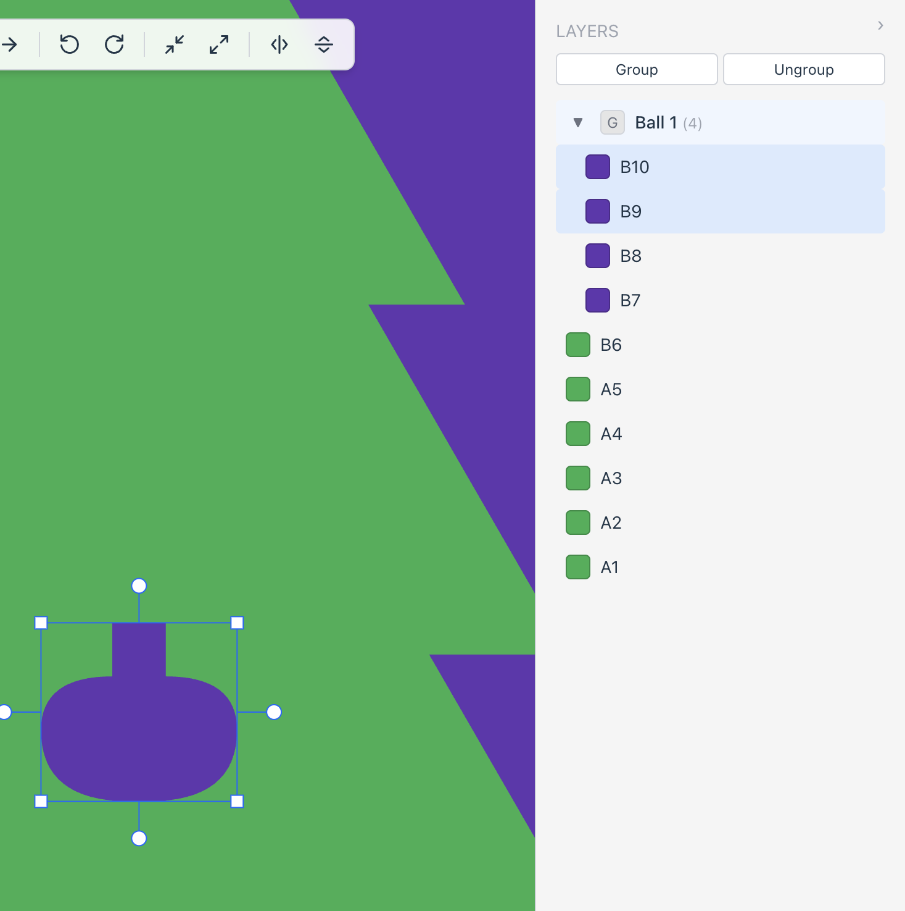

I'm unable to drag a selected layer out from a group in the layer panel. When I try to drag a layer out of its group, it just stays inside the group. Same if I have multiple layers selected within a group and try to drag them out. I am likewise unable to drag one or multiple layers into a group. Please fix this bug so that I can drag layers in and out of groups as expected. Aha! Actually, perhaps the layers are being moved correctly, because I noticed that when trying to move them around a layer would seems to disappear, but actually what I think is happening is that the layer is now under a a larger layer. So maybe the the only issue is that the layer panel UI is not updating correctly to reflect the new location of the layer after dragging. Please investigate if this hunch is correct

