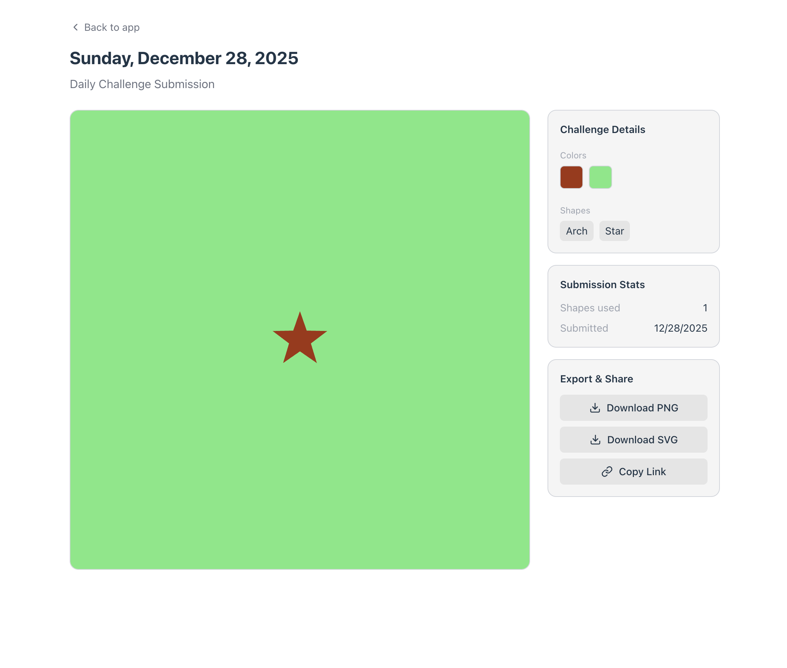

We need to improve the single submission page to make it more informative and user-friendly. Currently, when viewing a single submission, users see their submission along the challenge details, some statistics, and export tools. We should enhance this page by adding the following features:
1. Display the actual shapes used in the submission, not just their names. This will give viewers a better understanding of the artwork's composition.
2. Add navigation buttons to move to the next and previous submissions directly from the single submission view. This will allow users to browse through submissions without having to return to the list view.

