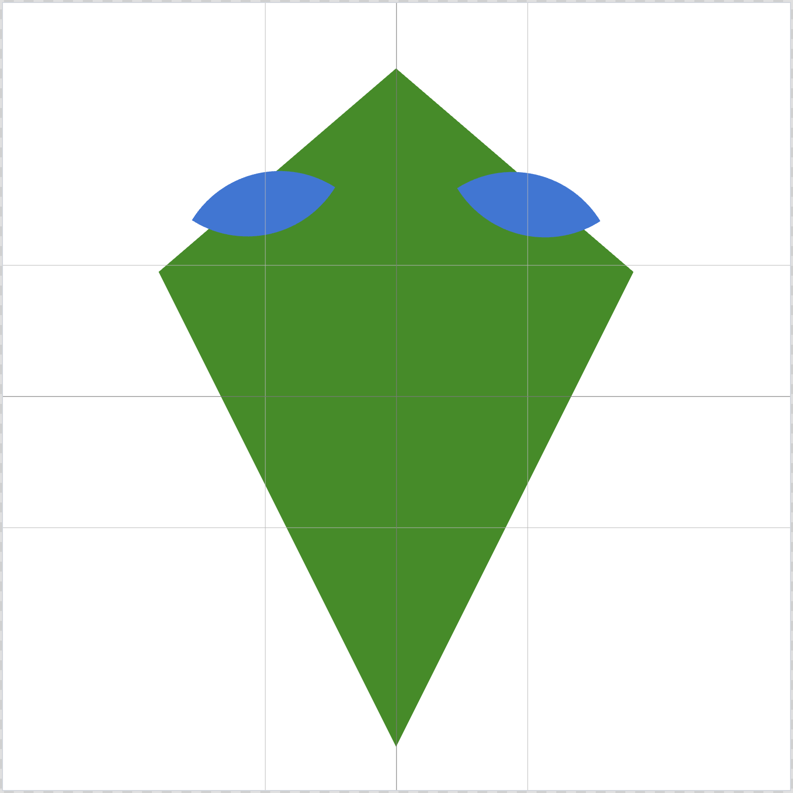

# Improve Color Contrast Between Daily Challenge Colors

## Status: Implemented

## Problem
The two random colors generated for the daily challenge could sometimes be very similar in hue and brightness, making them difficult to distinguish when layered on top of each other. For example, blue and green colors might pass the previous perceptual distance check but still look nearly identical when one shape is placed on top of another.

## Solution
Implemented WCAG-compliant contrast checking to ensure colors are easily distinguishable. The new algorithm uses three criteria:

1. **Perceptual Distance (existing)**: Minimum distance of 80 using weighted HSL formula
2. **WCAG Contrast Ratio (new)**: Minimum 3:1 ratio (WCAG AA requirement for large graphical objects)
3. **Hue Difference (new)**: Minimum 30 degrees of hue separation to ensure colors look distinctly different

## Implementation Details

### New Functions Added
- `parseHSL()`: Extracts H, S, L values from HSL color strings
- `hslToRgb()`: Converts HSL to RGB color space
- `getRelativeLuminance()`: Calculates WCAG relative luminance from RGB values
- `getContrastRatio()`: Computes WCAG contrast ratio between two colors

### Updated Functions
- `generateDistinctColors()`: Now checks all three criteria before accepting a color pair
- Fallback colors now use lightness values of 35% and 65% (instead of 45% and 55%) to guarantee better contrast

### Files Modified
- `src/utils/dailyChallenge.ts` - Client-side fallback generation
- `supabase/functions/get-daily-challenge/index.ts` - Server-side authoritative generation

## Technical Notes
- The WCAG contrast ratio is calculated using the formula: `(L1 + 0.05) / (L2 + 0.05)` where L1 is the lighter luminance
- Relative luminance follows the WCAG 2.1 specification with proper gamma correction
- The existing smart randomness system that avoids repeating recent challenges is preserved

## Original Request
> "One issue I have is that the randomly generated colors are sometimes too close to each other in hue and/or brightness, i.e. there is too low contrast between them, which makes them less fun to play around with. Case in point, today's challenge has a blue and green, but you can barely discern them when putting one on top of the other."

