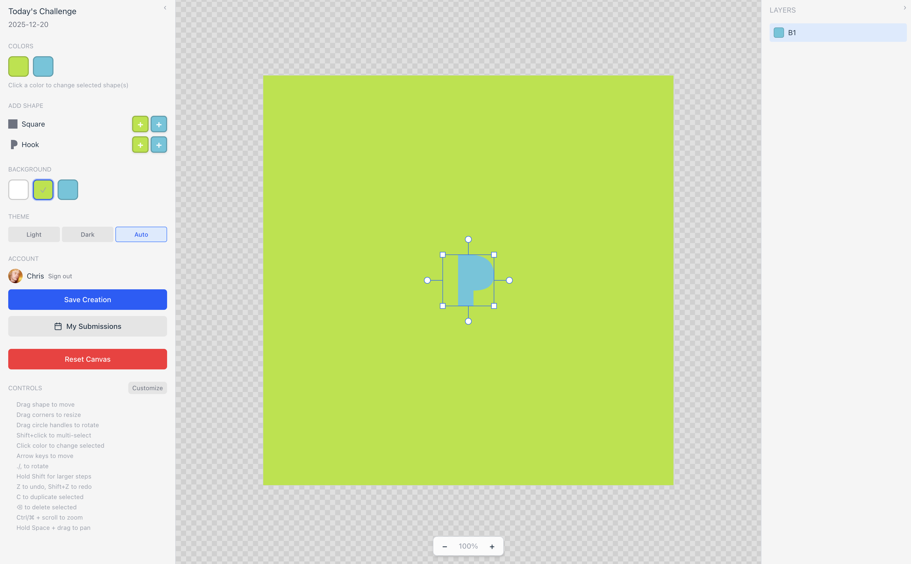

# Action Toolbar Feature

A mouse-friendly toolbar positioned at the top-center of the canvas, providing quick access to all major actions that were previously only available via keyboard shortcuts.

## Original Requirements

We have a lot of keyboard shortcuts for various tools and actions in the app, but if you're more accustomed to working with the mouse, there should be a toolbar with buttons for all the major actions. Currently the only things you can do with the mouse is resize and rotate shapes, but we should add buttons for all the other actions as well, like undo/redo, duplicate, delete, move shapes around, etc. The toolbar should be collapsible to save screen space when not needed. Perhaps the toolbar should be in middle, top of the screen? i.e. opposite the zoom functionality? or perhaps integrated with the zoom controls (keep all the canvas controls together). The toolbar should also show the current keyboard shortcut for each action when hovering over it, so users can learn the shortcuts if they want to. Use icons for the buttons to save space, with tooltips showing the action name and shortcut.

## Implementation Summary

### Component: `ActionToolbar.tsx`

A collapsible toolbar component positioned at the top-center of the canvas (opposite the zoom controls at bottom-center).

### Features Implemented

1. **Action Buttons**
   - Undo/Redo - with disabled state when no history available
   - Duplicate - duplicates selected shapes
   - Delete - deletes selected shapes
   - Move Up/Down/Left/Right - moves selected shapes by 1px
   - Rotate Clockwise/Counter-Clockwise - rotates selected shapes by 1 degree

2. **Collapsible Design**
   - Chevron toggle button to collapse/expand the toolbar
   - Collapses to just the toggle button to save screen space
   - Smooth rotation animation on the chevron icon

3. **Tooltips with Shortcuts**
   - Hover over any button to see:
     - Action name (e.g., "Undo", "Move Up")
     - Current keyboard shortcut (respects custom key mappings)
   - Shortcuts are formatted for display (e.g., "Shift+Z", "↑", "⌫")

4. **Disabled States**
   - Undo disabled when no history to undo
   - Redo disabled when no history to redo
   - Selection-dependent actions (duplicate, delete, move, rotate) disabled when no shapes selected

5. **Visual Design**
   - Consistent with ZoomControls styling (backdrop blur, rounded, shadow)
   - Uses theme CSS variables for colors
   - Hover states on buttons
   - Visual separators between action groups

### Icons

Custom SVG icons created inline (Feather Icons style):
- Undo: curved arrow left
- Redo: curved arrow right
- Duplicate: overlapping squares
- Delete: trash can
- Move arrows: directional arrows
- Rotate: circular arrows

### Integration

- Integrated in `App.tsx` in the main canvas area
- Positioned with `absolute top-4 left-1/2 -translate-x-1/2`
- Connected to existing state and handlers from `useCanvasState`
- Uses `keyMappings` to display current (possibly customized) shortcuts

### File Changes

- **New**: `src/components/ActionToolbar.tsx` - The toolbar component
- **Modified**: `src/App.tsx` - Added ActionToolbar import and integration
- **Modified**: `README.md` - Documented the new feature
