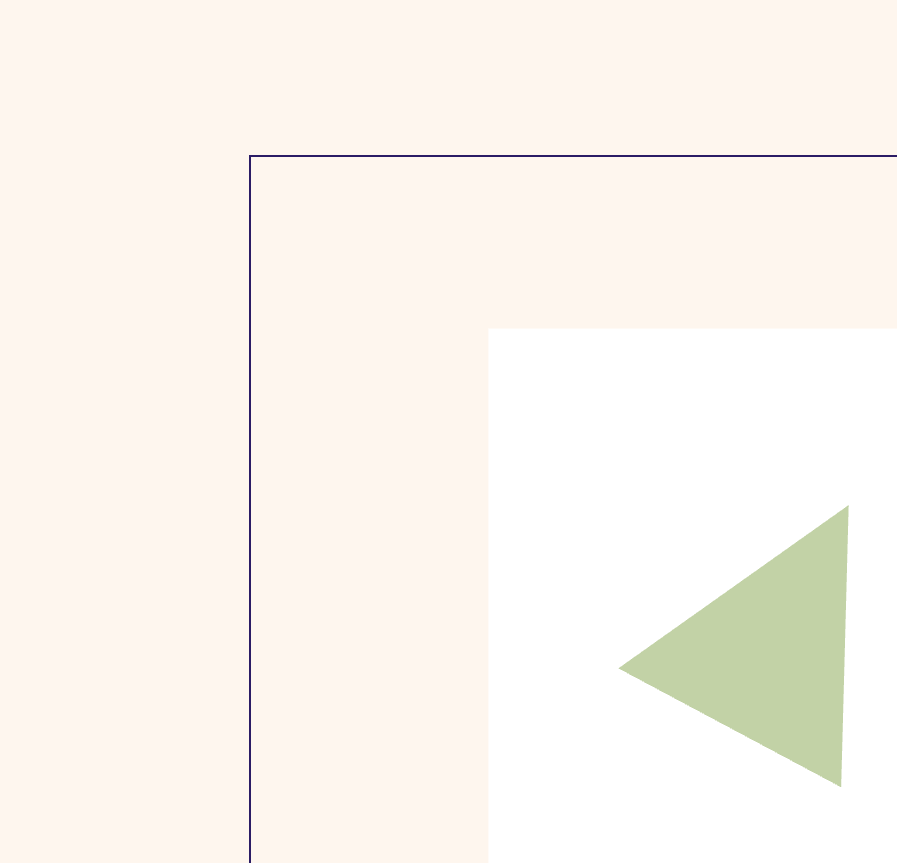
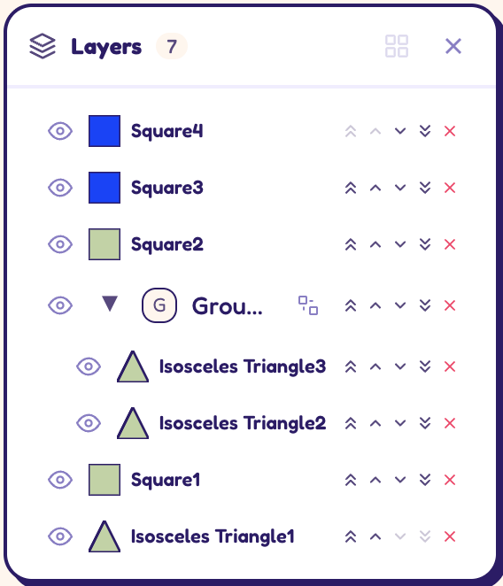
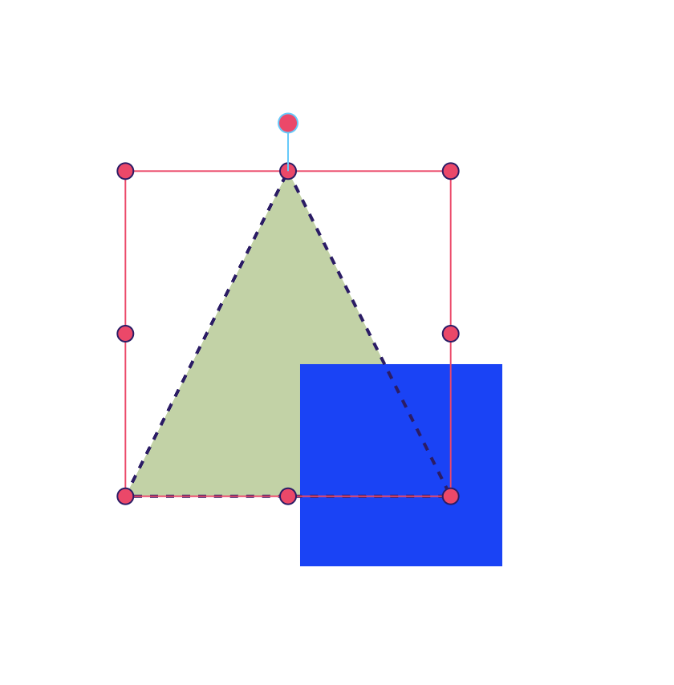
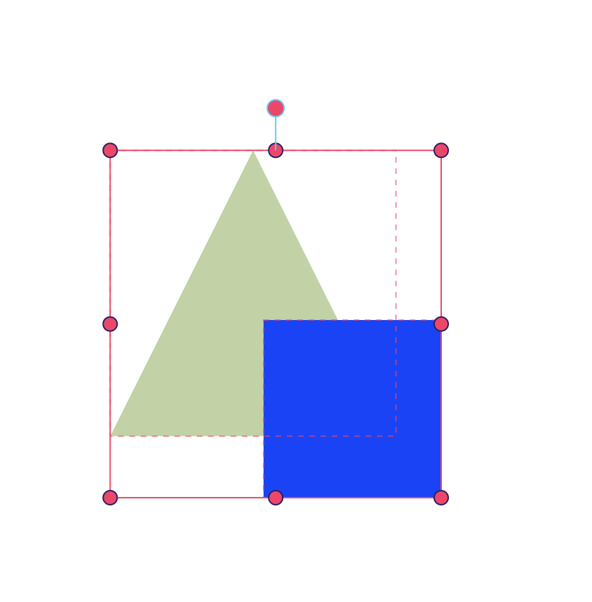
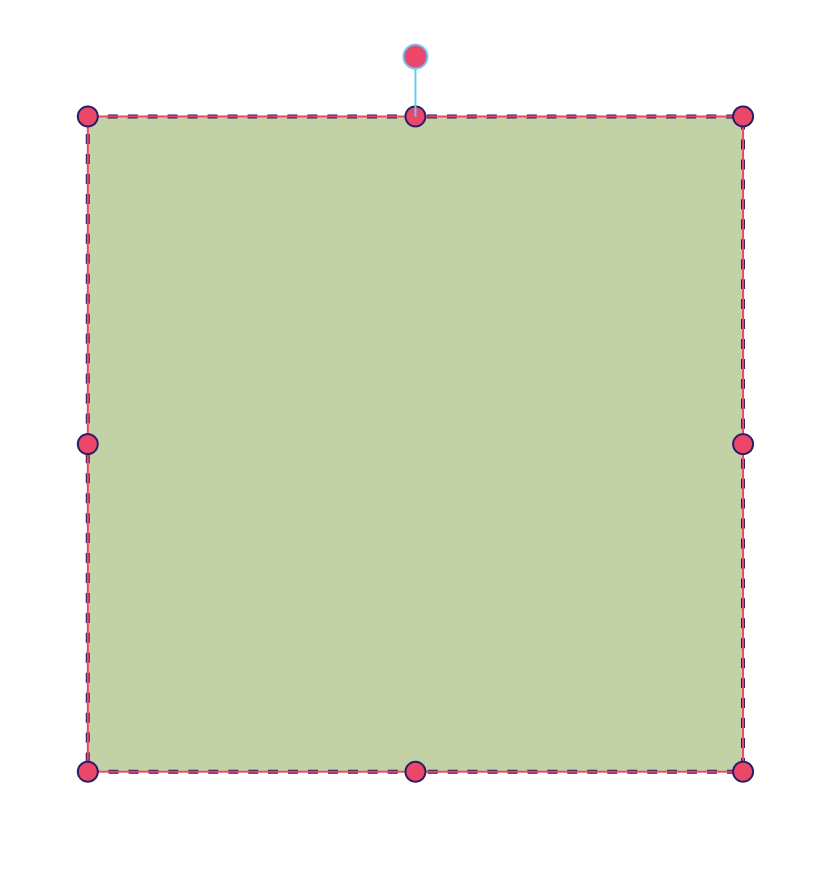
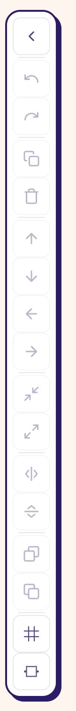
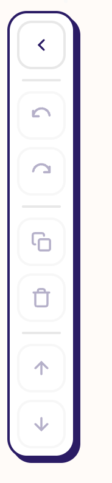

- when i move the canvas around by holding the spacebar and dragging, we have two problems. the first is that I get the sense that the fps is dropping, that the movement isn't as smooth as it should be, like a lot of calculations are happening that are making it laggy. Compare the current solution in this branch with what it looks like on the main branch, where things are perceivably a lot smoother. The second problem, which is also a problem on the main branch, is that instead of just panning around what we're seeing, it's like we're moving the actual canvas element - even the border of the canvas stays centered, and what we're moving is what has been drawn.  I want it to behave like it does in e.g. figma or photoshop, but right now it's strange.
- i should be able to pan the canvas with two fingers on the trackpad, just like i can with the spacebar + drag (like you can in figma etc). this is a pretty standard behavior for canvas-based design tools, and it would be nice to have it here as well.
- performance also feels laggy when you're dragging a shape around - again, it feels a lot smoother on the main branch, so compare the two and see if you can figure out why. it could be related to the same issue as the canvas dragging, but it also could be something else.
- add some padding between the layer name and the number, it's too cramped: 
- the selection UI on shapes seems a bit inconsistent. This is what it looks like when you have one shape selected:  - notice the black dashed outline on the triangle. And then this is what it looks like when you have multiple shapes selected:  - notice that the dashed outline which followed the triangle shape precisely (acting essentially as a border of the shape) is gone, instead replaced with a very faint red rectangular dashed outline. I think the first one is the right behavior, and that we should have the dashed outline follow the shape of the selected object(s) even when multiple objects are selected. Huh, I notice that the dark dashed outline/border isn't occurring on the square shape:  - so please make sure that the behaviour is consistent across all shapes, seems like we're handlind them differently for some reason.
- the left toolbar doesn't look quite like the design exploration. There's too little gap between the buttons, and the border doesn't look right? either the color or the thickness is off, it looks too faint.  compare with the design exploration: . 
- There seems to be one loading spinner when we load the main app and another loading spinner when we swap between the tabs of the gallery view and go into individual submissions. I would like this to just be one loading spinner. I don't want multiple loading spinners; I just want one. I think the one that we have inside the gallery section is the pretty one, as it uses the theme's colors a bit more. We don't want multiple components that do the same thing. We want one component that we reuse. That's the motto of this repo. 