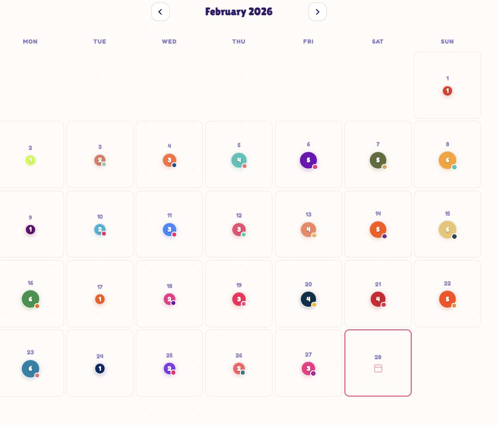
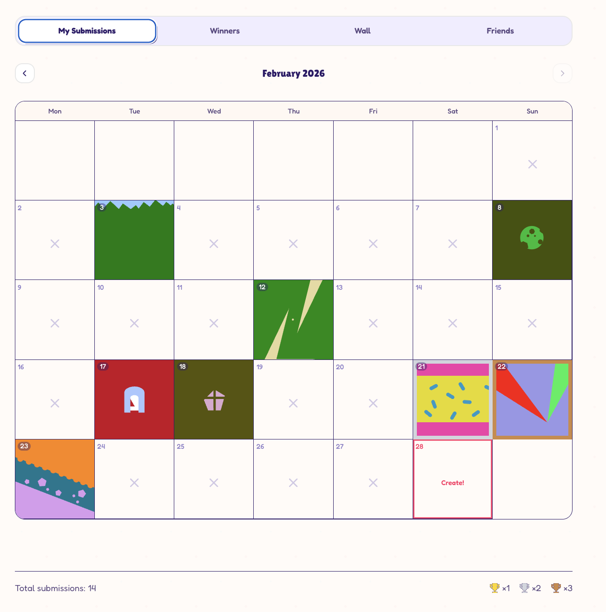
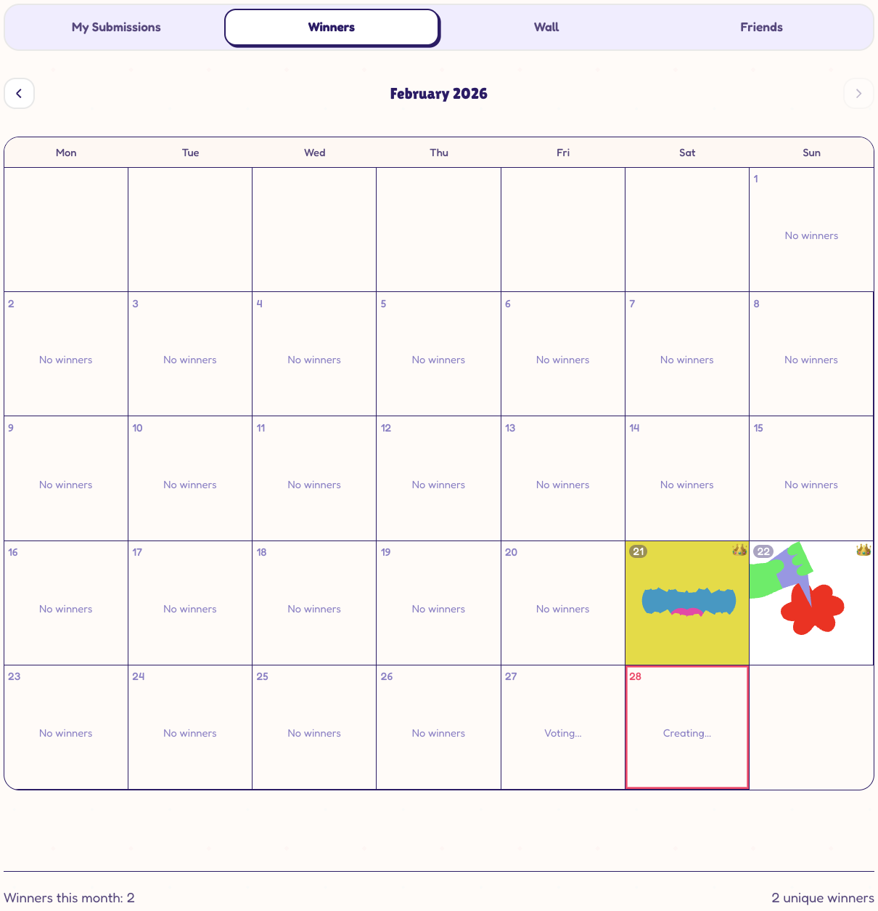
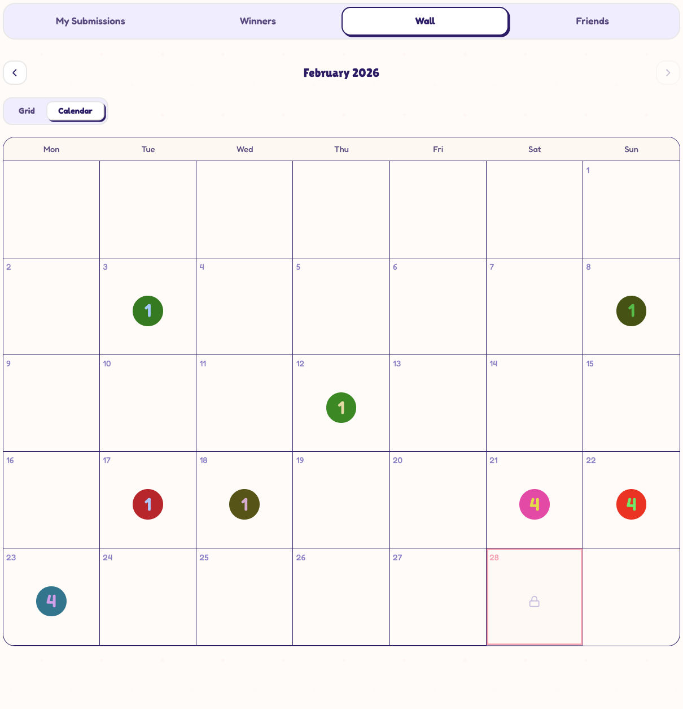
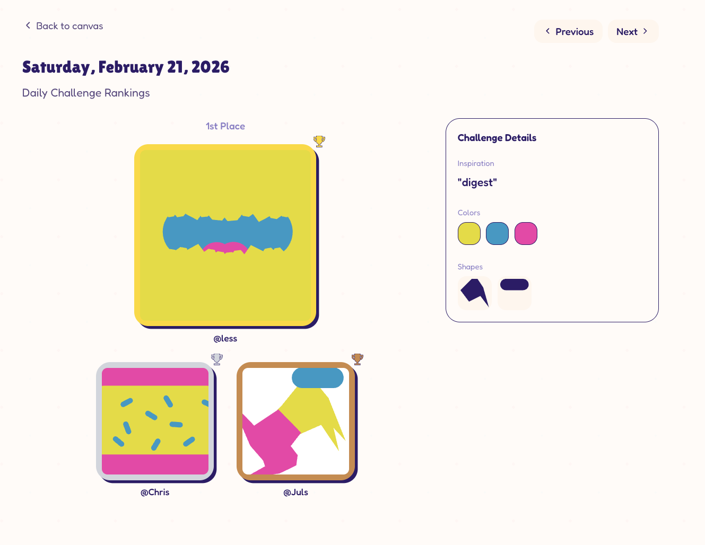
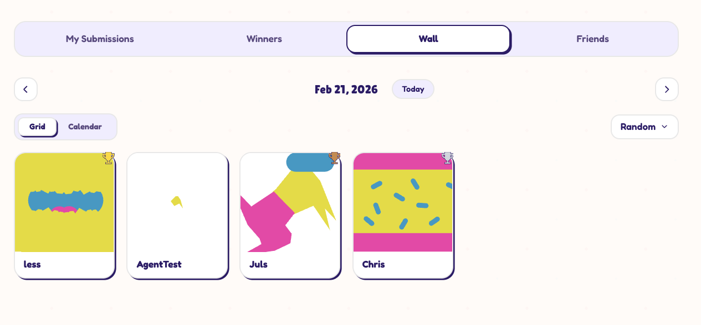
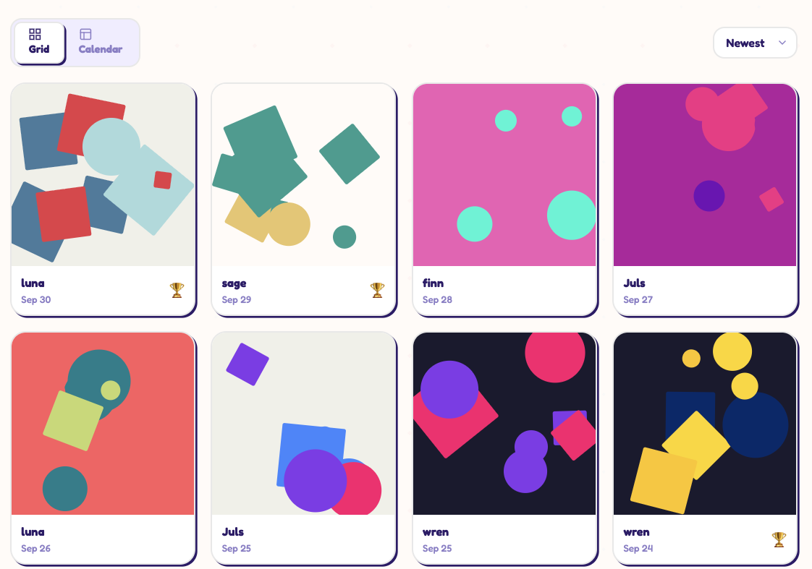
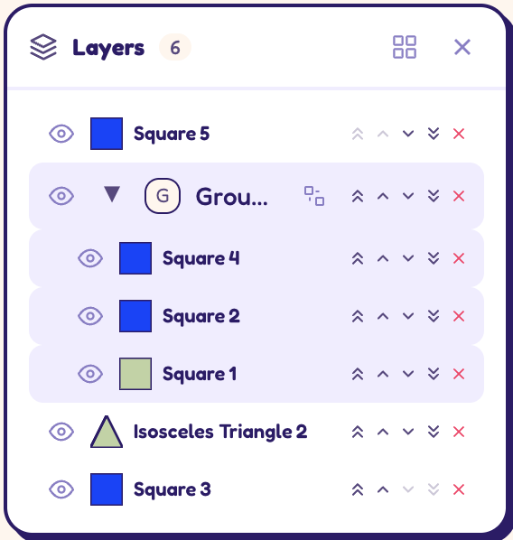

- Overall, I would like to adjust the feel when loading components/pages. If you look at what it looks like in the Design Exploration repo, when the user clicks between the tabs of the gallery view, like between the Winners tab and the Friends tab, there is a calendar view that loads from top to bottom with this kind of fading-in effect, which looks very pretty. In the actual working app, when we swap between the tabs, it kind of has this ugly flashing effect where it flashes between the two states and is just jarring and not very pleasant. I would like to make the animations apply to the loading of components and make this delightful and pleasing to the user. 
- Let's make the calendar across all the gallery tab views a bit softer. Take a look at the design exploration calendar and adopt that style a bit more. For example, remove the border that encompasses the entire calendar, give some space between the day cells and give them rounder corners. Also move the day's number to the center of the cell instead of the left top corner. All in all it gives the calendar a softer, more playful look. Refer to the design exploration calendar for guidance on this: 
- We need to make the calendar views consistent across all the gallery tabs. When looking at the various views, such as my own submissions, winners, the wall, and friends, you can see that there are different implementations across all of them. For example, in "my submissions", when there are no submissions, there's a cross in the day cell, and then if you look at the winners tab, it says no winners that day, and in the wall's calendar view there's no indication when a day cell is "empty", e.g. if there's no submission(s) to show. So it's all different, which is inconsistent and pointless.  ,  ,  . Change this so that if there's nothing to show, we don't display anything to indicate that, specifically.
- The winner's view needs a little attention. It seems like it hasn't been updated to the new design. We're missing the header, for example, and the details panel doesn't look like it does in e.g. the single submission view:  .
- In the grid view of the wall and friends tab, we can afford to give the submissions more space. I think four in a row horizontally gives them a bit more space to breathe, whereas right now we're making room for six across. Change this to four so the submissions become a bit bigger.  - compare with the design exploration: 
- The text in the center of the header bar is a bit small, I think. For example, sometimes it says "submission"; sometimes it says "gallery", depending on where you are in the app, but I think that could be one font size larger. 
- When I'm in a single submission view and I click back to gallery, it takes a few seconds before the various submissions load in the calendar view. It didn't take this long before the redesign, so I'm wondering if this is something that we've kind of broken somehow. Please refer to the main branch where this loads a bit quicker and see if we've broken something or what's going on. 
- The design implementation of the groups in the layer panel is a bit off:  - it looks a lot nicer in the design exploration:  .