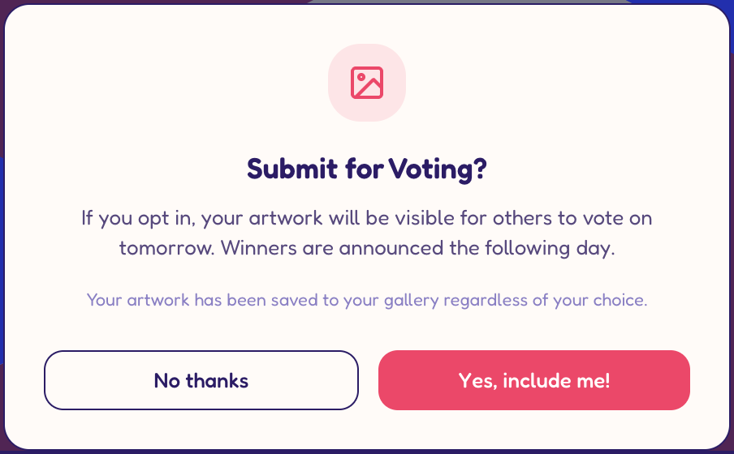

(fyi desgin exploration repo is the workspace 2colors-ui-exploration)

- why do we still have these buttons in modals? these types of buttons shouldn't exist anymore, it's not according to the design and we don't use them anywhere else in the app, so let's just remove them.  . 