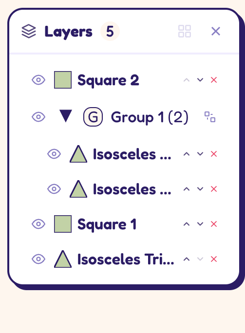
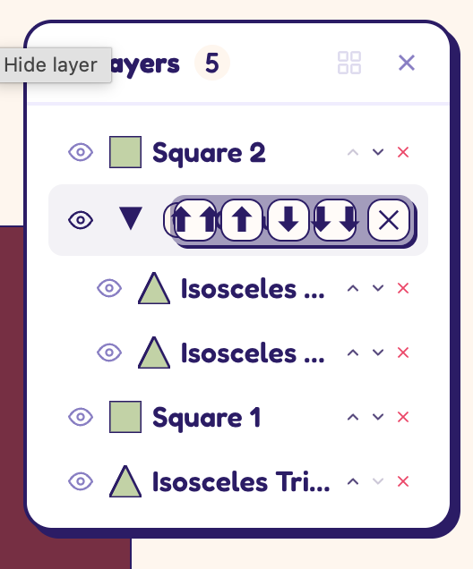

- if i have one or more shapes selected then click on the color in the bottom toolbar, all the shapes should change to that color (and the color should be applied to the shape in the toolbar as well - which it already does, I just mention it so that you don't change that behavior).
- we're missing the buttons in the layer panel to move the shapes all the way to the top or all the way to the bottom. for some reason it's been added to the group  only? but it looks awful:  . also, i don't want these settings to only be shown on hover, they should be visible all the time, just like the move up/down buttons. you can make the layer panel wider if you need to!
- the layer names in the layer panel, make that font smaller (again, using the next available font size from the design) - and i always want the number to be shown, regardless of how much the text has to be truncated.
- when I add a shape there's a funcitonality whereby I can click and drag to set the size of the shape. this is really nice, but when I'm dragging the shape isn't actually being rendered, so I don't get any visual feedback on how big the shape is until I release the mouse button.
- it would be nice to have the shapes animate a bit when they get added to the canvas, like we do in the design exploration repo (2colors-ui-exploration) - same when i add the background, it should fade in instead of just appearing.
